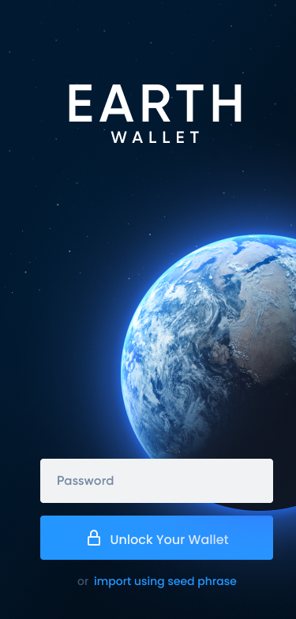

# 

[](https://earthwallet.io)

[](https://www.npmjs.com/package/@earthwallet/extension)
[](https://www.npmjs.com/package/@earthwallet/extension)
[](https://codeclimate.com/github/polkadot-js/extension)

Earth Wallet is a next generation digital asset wallet built for next generation blockchains. It enables developers and users to access:

- Lower transaction fees and faster settlement
- Next generation protocols for DeFi, DAOs and more
- Multi-chain interoperability within a single user experience

Veteran crypto users will feel right as home, as Earth Wallet was designed to keep the user experience similar to the popular Ethereum key management tool, Metamask. However, it was also designed and developed from the ground up to make the transition to next generation blockchains/protocols as seamless as possible for both veteran and new users.

Developers will also find a similar experience to what they are used to, with a very simple browser extension api, to delegate key management and transaction signing to Earth Wallet. To make it easier, we've also developed [@earthwallet/sdk](https://github.com/earthwallet/sdk) for additional helper functions.

Earth Wallet is still in Beta, so please use it at your own risk. We are always hiring auditors and developers, contact us at gaurdians@earthwallet.io if interested.

## Installation

- Signup to the waiting list [here](https://earthwallet.io) for early access!



## Documentation and examples

Find out more about how to use the extension as a Dapp developper, cookbook, as well as answers to most frequent questions in the [Earth Wallet Documentation](https://docs.earthwallet.io/).

## Development version

Steps to build the extension and view your changes in a browser:

1. Build via `yarn build` or `yarn watch`
2. Install the extension

- Chrome:
  - go to `chrome://extensions/`
  - ensure you have the Development flag set
  - "Load unpacked" and point to `packages/extension/build`
  - if developing, after making changes - refresh the extension
- Firefox:
  - go to `about:debugging#addons`
  - check "Enable add-on debugging"
  - click on "Load Temporary Add-on" and point to `packages/extension/build/manifest.json`
  - if developing, after making changes - reload the extension

3. When visiting a Web3.0 project like `https://social.network` it will inject the extension

## Development

The repo is split into a number of packages -

- [extension](packages/extension/) - All the injection and background processing logic (the main entry)
- [extension-ui](packages/extension-ui/) - The UI components for the extension, to build up the popup

## Dapp developers

The actual in-depth technical breakdown is given in the next section for any dapp developer wishing to work with the raw objects injected into the window. However, convenience wrappers are provided that allows for any dapp to use this extension (or any other extension that conforms to the interface) without having to manage any additional info.

The documentation for Dapp development is available [in the Earth Wallet docs](https://docs.earthwallet.io).

## API interface

The extension injection interfaces are generic, i.e. it is designed to allow any extension developer to easily inject extensions (that conforms to a specific interface) and at the same time, it allows for any dapp developer to easily enable the interfaces from multiple extensions at the same time. It is not an all-or-nothing approach, but rather it is an ecosystem where the user can choose which extensions fit their style best.

From a dapp developer perspective, the only work needed is to include the [@earthwallet/sdk/dapp] package and call the appropriate enabling function to retrieve all the extensions and their associated interfaces.

From an extension developer perspective, the only work required is to enable the extension via the razor-thin [@earthwallet/sdk/inject] wrapper. Any dapp using the above interfaces will have access to the extension via this interface.

When there is more than one extension, each will populate an entry via the injection interface and each will be made available to the dapp. The `Injected` interface, as returned via `enable`, contains the following information for any compliant extension -

```js
interface Injected {
  // the interface for Accounts, as detailed below
  readonly accounts: Accounts;
  // the standard Signer interface for the API, as detailed below
  readonly signer: Signer;
  // not injected as of yet, subscribable provider for polkadot-js API injection,
  // this can be passed to the API itself upon construction in the dapp
  // readonly provider?: Provider
}

interface Account = {
  // ss-58 encoded address
  readonly address: string;
  // the genesisHash for this account (empty if applicable to all)
  readonly genesisHash?: string;
  // (optional) name for display
  readonly name?: string;
};

// exposes accounts
interface Accounts {
  // retrieves the list of accounts for right now
  get: () => Promise<Account[]>;
  // (optional) subscribe to all accounts, updating as they change
  subscribe?: (cb: (accounts: Account[]) => any) => () => void
}

// a signer that communicates with the extension via sendMessage
interface Signer extends SignerInterface {
  // no specific signer extensions, exposes the `sign` interface for use by
  // the polkadot-js API, confirming the Signer interface for this API
}
```

## Injection information

The information contained in this section may change and evolve. It is therefore recommended that all access is done via the [@earthwallet/sdk/dapp] (for dapps) and [@earthwallet/sdk/inject] (for extensions) packages, which removes the need to work with the lower-level targets.

The extension initializes web3 accounts by `initWeb3` into the global `window` object, exposing the following: (This is meant to be generic across extensions, allowing any dapp to utilize multiple signers, and pull accounts from multiples, as they are available.)

```js
window.initWeb3 = {
  // this is the name for this extension, there could be multiples injected,
  // each with their own keys, here `earthwallet` is for this extension
  'earthwallet': {
    // semver for the package
    version: '0.1.0',

    // this is called to enable the injection, and returns an injected
    // object containing the accounts, signer and provider interfaces
    // (or it will reject if not authorized)
    enable (originName: string): Promise<Injected>
  }
}
```

## Mnemonics, Passwords, and Imports/Exports

### Using the mnemonic and password from the extension

When you create a keypair via the extension, it supplies a 12-word mnemonic seed and asks you to create a password. This password only encrypts the mnemonic and private key on disk so that the password is required to spend funds in `earthwallet` or to import the account from backup. The password does not protect the mnemonic phrase. That is, if an attacker were to acquire the mnemonic phrase, they would be able to use it to spend funds without the password.


To Add a new package
1) Add package to /tsconfig.json
2) Add package to /packages/extension/webpack.shared.cjs


To Run Dapp
yarn build && yarn dapp
